<!-- print(''.join(chr(x-7) for x in [104,105,107,124,115,39,121,104,111,116,104,117])) -->
<!-- assets/*.svg are generated by tools/. Every number in them is measured or
     counted; nothing on this page is an illustration of a thing that did not
     happen. Each plate ships in two themes and the <picture> tags below pick
     between them, so the page follows your GitHub theme rather than fighting it. -->

<div align="center">

<picture>
  <source media="(prefers-color-scheme: dark)" srcset="assets/hero-dark.svg">
  
</picture>

<br>

<a href="https://abdu7rahman.github.io/demo.html"><picture><source media="(prefers-color-scheme: dark)" srcset="assets/link-demo-dark.svg"></picture></a>
<a href="https://abdu7rahman.github.io/"><picture><source media="(prefers-color-scheme: dark)" srcset="assets/link-site-dark.svg"></picture></a>
<a href="https://linkedin.com/in/abdu7rahman"><picture><source media="(prefers-color-scheme: dark)" srcset="assets/link-linkedin-dark.svg"></picture></a>
<a href="mailto:mohammedabdulr.1@northeastern.edu"><picture><source media="(prefers-color-scheme: dark)" srcset="assets/link-email-dark.svg"></picture></a>

</div>

---

Advanced Robotics and AI intern at **Siemens**. MS Robotics at **Northeastern University** ('27),
BE in Computer Science from **Osmania University**. Before grad school I spent five years on
**Team Robocon MJCET**, working up from junior programmer to leading a 20+ member team to its first
national competition in five years.

I work on physical AI and the motion stack underneath it — planning, reactive replanning, legged
locomotion, and the unglamorous bringup that makes any of it run on real hardware. Lately I've been
pointing learned policies at deformable objects and watching them fail in instructive ways.

| | |
| --- | --- |
| **Now** | Advanced Robotics and AI intern at Siemens, Berkeley |
| **Building** | Sim-to-real transfer of bimanual garment policies onto a UR12e |
| **Next** | Inverse RL on quadruped locomotion, aimed at a Unitree Go2 |
| **Always** | Planners written from scratch, then measured rather than assumed |

## Systems

<table>
<tr><th align="left" width="32%">System</th><th align="left">What it does</th><th align="left" width="19%">Numbers</th></tr>

<tr><td valign="top">

**Bimanual garment manipulation**

`Isaac Sim` `π0 / π0.5` `OpenPI`
`ACT` `Diffusion Policy` `smolVLA`

</td><td valign="top">

Trained and evaluated ACT, Diffusion Policy and smolVLA on multi-garment folding in a bimanual
setup, alongside work with π0, π0.5 and OpenPI across the VLA stack. Sim-to-real transfer onto a
UR12e is in progress.

</td><td valign="top">

**60.4%** success<br>
across 4 categories<br>
**78%** peak, long top

</td></tr>

<tr><td valign="top">

**[Reactive replanning on a UR12e](https://github.com/abdu7rahman/reactive-replanning-ur12e)**

[run the detector](https://abdu7rahman.github.io/demo.html#reach)

`ROS 2 Jazzy` `MoveIt 2` `BIT*`
`RealSense D435i` `OctoMap`

</td><td valign="top">

UR12e + Robotiq Hand-E. A depth pipeline with workspace filtering, robot self-masking and
colour-based body exclusion isolates live obstacles; the arm cancels cleanly and re-plans from its
current state mid-motion.

</td><td valign="top">

**100%** detection<br>
≥4 cm, 0.10 s<br>
blind within **11 cm**

</td></tr>

<tr><td valign="top">

**[Reactive autonomous nav stack](https://github.com/abdu7rahman/reactive_autonomous_nav)**

[drive it](https://abdu7rahman.github.io/demo.html#drive) · [race the controllers](https://abdu7rahman.github.io/demo.html#race)

`ROS 2 Jazzy` `TurtleBot4` `C++`
`nav2_costmap_2d`

</td><td valign="top">

A modular planner/controller architecture built from scratch — no Nav2 BT server. A\*, Theta\*, SMAC
and RRT behind one global interface; DWA, Pure Pursuit, Stanley, TEB and MPPI behind another.

</td><td valign="top">

**99–192×** faster<br>
after the C++ port<br>
[measured](https://abdu7rahman.github.io/#measured)

</td></tr>

<tr><td valign="top">

**Robot foundation model**

`PyTorch` `Flow matching` `GRPO`
`Pydantic`

</td><td valign="top">

A flow-matching VLA, a latent world model and an RL-tuned reasoner on one backbone, with an
orchestration layer above that never touches the weights. It trains, and it has still never
completed the task. The one real result is the competence signal.

</td><td valign="top">

**0 of 16** completed<br>
AUROC **0.946**<br>
vs controls at 0.11

</td></tr>

<tr><td valign="top">

**[K.A.L.B — legged robot](https://github.com/abdu7rahman/K.A.L.B)**

[watch it walk](https://youtu.be/ESjXvtUxYeM)

`ROS 2` `Gazebo` `gmapping` `AMCL`

</td><td valign="top">

A quadruped with locomotion modelled after the MIT Cheetah. Gait stability and autonomous
navigation validated with SLAM in Gazebo; now collecting demonstrations for inverse RL.

</td><td valign="top">

**12** axes<br>
SLAM + AMCL<br>
→ Unitree Go2

</td></tr>

<tr><td valign="top">

**[Custom DWA local planner](https://github.com/abdu7rahman/Custom-DWA-Local-Planner)**

[watch the rollouts](https://youtu.be/yFtexC6-Z1g)

`ROS 2 Humble` `TurtleBot3` `RViz`

</td><td valign="top">

DWA written from scratch rather than pulling in `nav2_dwb_controller` — velocity sampling,
trajectory rollout, cost evaluation, and marker visualisation of every candidate.

</td><td valign="top">

**6** stars<br>
most-starred repo

</td></tr>

</table>

## Tonight's search

<div align="center">
<picture>
  <source media="(prefers-color-scheme: dark)" srcset="assets/run-dark.svg">
  
</picture>
</div>

> Not a screenshot. A GitHub Action seeds a fresh map every night, fetches `astar_planner.py` and
> `theta_star_planner.py` from [the nav repo](https://github.com/abdu7rahman/reactive_autonomous_nav),
> runs both searches, and renders the expansion order into the plate above. The node counts and
> millisecond figures are whatever that run produced —
> [the generator is here](tools/gen_run.py). Both planners get the same map and the same seed, so the
> difference in how much of it they had to look at is the difference between the two algorithms.
>
> Want to drive one yourself? [These repos run in your browser](https://abdu7rahman.github.io/demo.html) —
> search a map you draw with any of five planners, chase a cursor with the DWA controller while you
> throw obstacles at it, race all five local controllers over one plan, or reach into the UR12e's
> cell and block the arm until it cancels the motion and replans around you.

## Counted

<div align="center">
<picture>
  <source media="(prefers-color-scheme: dark)" srcset="assets/stats-dark.svg">
  
</picture>
</div>

<details>
<summary>Where these numbers come from</summary>

<br>

Counted from the git history of every repo on this account. Commits are filtered to my own
authorship; the language mix excludes two repos built on forked upstreams (`K.A.L.B`,
`lehome-challenge`) so vendored code doesn't skew the split.

| Language | Share | Bytes |
| --- | ---: | ---: |
| Python | 30.7% | 594 KiB |
| CMake | 18.1% | 351 KiB |
| YAML | 15.0% | 290 KiB |
| XML / URDF / XACRO | 14.8% | 286 KiB |
| C++ | 8.5% | 164 KiB |
| Other (C, Shell, Arduino, HTML) | 12.9% | 249 KiB |
| **Total** | **100%** | **1.89 MiB** |

| Commit cadence | |
| --- | ---: |
| Commits authored | 240 |
| Window | Jul 2021 → Jul 2026 (61 months) |
| Active months | 20 |
| Median, active month | 8 |
| Peak month | 49 (Apr 2026) |

</details>

## Trajectory

```
2026 ──●  Siemens · Advanced Robotics and AI Intern        Jun 2026 –
       │  Berkeley, California. On-site.
       │
       ●  Northeastern University · Graduate Lab Assistant  Apr – Jun 2026
       │  ROS 2 bag collection from a Ford Mustang Mach-E autonomous
       │  vehicle platform, with visual SLAM run over the recorded drives
       │  for trajectory analysis. UR12e URDF with Robotiq integration and
       │  the MoveIt 2 stack for faculty research, plus an end-effector
       │  camera mount now used across several setups.
       │
2025 ──●  MS Robotics, Electrical & Computer Engineering    2025 – 2027
       │  Northeastern University
       │
2020 ──●  BE Computer Science & Engineering                 2020 – 2024
       │  Osmania University, Hyderabad
       │
       ●  Team Robocon MJCET                          Dec 2020 – Jul 2025
       │  Junior Programmer → Programmer → Robotics Control Engineer
       │  → Team Lead/Captain → Team Mentor
       │
       │  ABU Robocon 2021 · pitch-pot        holonomic chassis, pneumatic
       │    arrow handling, spring-based shooter
       │  ABU Robocon 2022 · lagori           omni shooter + swerve, CV for
       │    incoming balls, ML predicting where the stack would fall
       │  ABU Robocon 2023 · Angkor Wat       omni + mecanum, ring and pole
       │    detection, collection and shooting
       │  ABU Robocon 2024 · Harvest Day      the team's first national
       │    appearance in over five years. Two holonomic drives, ball
       │    shooters, pneumatic seedling collection, silo placement. ROS
       │    waypoint navigation, colour-based ball detection, and an ML
       │    policy that picked silo placements against the opponent.
       │  ABU Robocon 2025 · robot basketball 2v2, as mentor — ROS guidance
       │    and play strategy
       │
2022 ──●  Consciente Technologies · Robotics Engineer Intern  Aug – Sep 2022
       │  DH parameters and MoveIt configuration for a custom 5-DOF
       ●  manipulator; coordinate-based autonomous navigation on hardware.
```

---

<div align="center">

**Send a goal pose**

<a href="mailto:mohammedabdulr.1@northeastern.edu"><picture><source media="(prefers-color-scheme: dark)" srcset="assets/link-email-dark.svg"></picture></a>

<br>

<sub>building robots that may work &nbsp;·&nbsp; if it planned on the first try, the obstacle was imaginary</sub>

</div>
