<!-- print(''.join(chr(x-7) for x in [104,105,107,124,115,39,121,104,111,116,104,117])) -->
<!-- assets/*.svg are hand-authored and animated. the numbers in them are measured, not quoted. -->

<div align="center">



<br>

[](https://linkedin.com/in/abdu7rahman)
[](mailto:mohammedabdulr.1@northeastern.edu)
[](https://abdu7rahman.github.io/)


</div>


## &nbsp;▸&nbsp; WHOAMI

```console
$ rosnode info /abdu7rahman
```

Advanced Robotics and AI intern at **Siemens**. MS Robotics at **Northeastern University** ('27), BE in Computer Science
from **Osmania University**. Before grad school I spent five years on **Team Robocon MJCET**, working up
from junior programmer to leading a 20+ member team to its first national competition in five years.

I work on physical AI and the motion stack underneath it — planning, reactive replanning, legged
locomotion, and the unglamorous bringup that makes any of it run on real hardware. Lately I've been
pointing learned policies at deformable objects and watching them fail in instructive ways.

<table>
<tr>
<td width="33%" valign="top">

**`▸ NOW`**

Advanced Robotics and AI intern
at **Siemens**, Berkeley. Before
that, Northeastern's robotics lab
— ROS 2 bag collection and visual
SLAM on a **Ford Mustang Mach-E**
AV platform, the UR12e + Robotiq
MoveIt 2 stack, and a camera mount
now used across several faculty
setups.

</td>
<td width="33%" valign="top">

**`▸ NEXT`**

Sim-to-real transfer of bimanual
garment-folding policies onto a
real UR12e. Inverse RL on quadruped
locomotion demonstrations, aimed at
a **Unitree Go2**. Finishing the C++
port of the navigation stack — the
[measurements](#measured) below are
what motivated it.

</td>
<td width="33%" valign="top">

**`▸ ALWAYS`**

Planners written from scratch
before reaching for a library,
because the failure modes are the
interesting part. Numbers I can
reproduce rather than numbers I
remember. PCBs, end effectors, and
the occasional robot that throws an
arrow across an arena.

</td>
</tr>
</table>


## &nbsp;▸&nbsp; THE LAB

<div align="center">

</div>

> Three things I actually built, simulated in SVG rather than screenshotted. **Left:** velocity rollouts get
> sampled, scored on heading, clearance and speed, and the winner is committed while the rest are discarded.
> **Middle:** the end-effector pose never moves — the arm changes *which* IK solution reaches it, travelling
> along the elbow self-motion manifold to clear the obstacle. **Right:** a diagonal trot, knee bending
> backward on the front pair and forward on the rear.


<h2 id="measured">&nbsp;▸&nbsp; MEASURED</h2>

I claimed in a résumé that porting my planners to C++ made them faster. That was an impression, so I
wrote a harness and turned it into a number. It found something I didn't expect.

<div align="center">

</div>

The A\* gap is not all language. The C++ port also introduced a closed set, so it expands 21,015 nodes
where Python expands 61,631 on the same map — roughly 3× of the difference is algorithmic and the rest is
`heapq` of tuples versus a `priority_queue` of PODs.

The DWA result is the one that surprised me: the speedup *shrinks* as the batch grows. At the window the
controller actually evaluates each cycle, numpy is paying fixed per-call overhead across a few dozen
trajectories and loses by 26×. Hand it 2,626 trajectories and vectorisation amortises that down to 4×.
So the C++ port buys the most where it matters least — both clear a 20 Hz budget on the real window — and
the global planner is where it actually earns its keep.

### Obstacle detection, and where it goes blind

The UR12e demo either sees the hand or it doesn't. I wrote a harness that drives the detector's own
`_cloud_cb` on synthetic frames with a known ground-truth obstacle, so misses get counted instead of
estimated.

| Obstacle radius | Detected | Centroid error | Latency |
| ---: | ---: | ---: | ---: |
| 2 cm | 0 / 40 | — | — |
| 3 cm | 0 / 40 | — | — |
| 4 cm | **40 / 40** | 2.3 mm | 0.10 s |
| 6 cm | **40 / 40** | 2.1 mm | 0.10 s |
| 10 cm | **40 / 40** | 2.1 mm | 0.10 s |

Below ~4 cm an object returns fewer points than the threshold and is never seen. Above it the detector
saturates — size stops mattering, the centroid lands within 2 mm, detection takes two frames at 20 Hz.
**0 false positives in 300 frames** with the arm in view, and the pipeline runs in 2.47 ms against a
50 ms budget, so latency is the debounce counter rather than compute.

Then the number I'd rather publish than hide — an obstacle walked in toward the forearm:

| Distance to nearest link | 8 cm | 10 cm | 11 cm | 12 cm | 30 cm |
| --- | ---: | ---: | ---: | ---: | ---: |
| Detected | **0%** | **0%** | 76% | 100% | 100% |

`ARM_SEG_RADIUS` carves a 12 cm tube around the kinematic chain and everything inside it is discarded
as the robot's own body. A hand closer than ~11 cm to a link is *invisible*, not detected late. It's a
deliberate trade against phantom detections off the arm, but it means the safety claim is "avoids what
it can see" — and things within 11 cm aren't in that set.

<sub>The detector is real code; the sensor is modelled — no occlusion shadow, no RealSense speckle, no lighting variation. These bound the clean-input case and locate the geometric cliffs exactly. Method: [`reactive-replanning-ur12e/tests`](https://github.com/abdu7rahman/reactive-replanning-ur12e/tree/bench/detection-tests/tests)</sub>

### Garment folding, against the literature

Published figures, each measured on its own task. **This is context, not a leaderboard** — no two rows
share a task, a robot or a success criterion.

| System | Reported | Measured on | Source |
| --- | --- | --- | --- |
| **This project** — ACT / Diffusion Policy / smolVLA | **60.4%** avg, **78%** peak | Bimanual multi-garment folding, 4 categories, Isaac Sim | — |
| SpeedFolding — Avigal et al., IROS 2022 | 93%, <120 s per fold | Real garments from a random initial configuration, engineered bimanual primitives, 4,300 annotated actions | [2208.10552](https://arxiv.org/abs/2208.10552) |
| ACT — Zhao et al., RSS 2023 | 80–90% | Six fine-grained bimanual tasks (battery slotting, condiment cup). Rigid objects | [2304.13705](https://arxiv.org/abs/2304.13705) |
| smolVLA — Hugging Face, 2025 | 78.3% | SO100 pick-place, stacking, sorting. Rigid objects | [blog](https://huggingface.co/blog/smolvla) |
| Diffusion Policy — Chi et al., RSS 2023 | +46.9% over prior SOTA | 12 tasks across 4 manipulation benchmarks | [2303.04137](https://arxiv.org/abs/2303.04137) |

Two things it does show. The 78–90% those architectures report is on **rigid** objects — none of it is
deformables, which is the part that makes garments hard. And the one row that *is* garment folding,
SpeedFolding at 93%, gets there with engineered bimanual action primitives and 4,300 annotated actions
rather than an end-to-end learned policy. The distance between 60.4% and 93% is mostly that gap.

<sub>Harness and method: [`reactive_autonomous_nav/bench`](https://github.com/abdu7rahman/reactive_autonomous_nav/tree/main/bench) · `./bench/run.sh` reproduces every number · nothing is reimplemented, both harnesses call the planners' own code</sub>


## &nbsp;▸&nbsp; SYSTEMS

<table>
<tr><th align="left" width="33%">System</th><th align="left">What it does</th><th align="left" width="20%">Numbers</th></tr>

<tr><td valign="top">

**Bimanual Garment Manipulation**

`Isaac Sim` `ACT` `Diffusion Policy`
`smolVLA` `Physical AI`

</td><td valign="top">

Trained and evaluated three policy architectures on multi-garment folding in a bimanual setup.
Sim-to-real transfer onto a UR12e is in progress.

</td><td valign="top">

**60.4%** success<br>
across 4 categories<br>
**78%** peak, long top

</td></tr>

<tr><td valign="top">

**[Dynamic Bin Picking + Reactive Replanning](https://github.com/abdu7rahman/reactive-replanning-ur12e)**

`ROS 2 Jazzy` `MoveIt 2` `BIT*`
`RealSense D435i` `OctoMap`

</td><td valign="top">

UR12e + Robotiq Hand-E. A depth pipeline with workspace filtering, robot self-masking and colour-based
body exclusion isolates live obstacles; the arm cancels cleanly and re-plans from its current state
mid-motion.

</td><td valign="top">

**100%** detection<br>
≥4 cm, 0.10 s<br>
blind within **11 cm**

</td></tr>

<tr><td valign="top">

**[Reactive Autonomous Nav Stack](https://github.com/abdu7rahman/reactive_autonomous_nav)**

`ROS 2 Jazzy` `TurtleBot4` `C++`
`nav2_costmap_2d`

</td><td valign="top">

A modular planner/controller architecture built from scratch — no Nav2 BT server. A\*, Theta\*, SMAC and
RRT behind one global interface; DWA shipped, with Pure Pursuit, Stanley, TEB and MPPI in progress.

</td><td valign="top">

**99–192×** faster<br>
after the C++ port<br>
[(measured)](#measured)

</td></tr>

<tr><td valign="top">

**[K.A.L.B — Legged Robot](https://github.com/abdu7rahman/K.A.L.B)** · [▶ demo](https://youtu.be/ESjXvtUxYeM)

`ROS 2` `Gazebo` `gmapping` `AMCL`

</td><td valign="top">

A quadruped with locomotion modelled after the MIT Cheetah. Gait stability and autonomous navigation
validated with SLAM in Gazebo; now collecting demonstrations for inverse RL.

</td><td valign="top">

**12** axes<br>
SLAM + AMCL<br>
→ Unitree Go2

</td></tr>

<tr><td valign="top">

**[Custom DWA Local Planner](https://github.com/abdu7rahman/Custom-DWA-Local-Planner)** · [▶ demo](https://youtu.be/yFtexC6-Z1g)

`ROS 2 Humble` `TurtleBot3` `RViz`

</td><td valign="top">

DWA written from scratch rather than pulling in `nav2_dwb_controller` — velocity sampling, trajectory
rollout, cost evaluation, and marker visualisation of every candidate.

</td><td valign="top">

⭐ **6** stars<br>
most-starred repo

</td></tr>

<tr><td valign="top">

**[PX100 Puppet Control](https://github.com/abdu7rahman/pincher-x100-puppet-control)** · [▶ demo](https://www.youtube.com/watch?v=WEzc5oIadew)

`ROS 2 Humble` `MediaPipe` `MoveIt 2`

</td><td valign="top">

Vision-only teleoperation: hand position maps to four joints, thumb-index pinch drives the gripper.
No VR, no controller, and not a defensible way to run a manipulator — a proof of concept for intuitive
interfaces.

</td><td valign="top">

**30** FPS tracking<br>
**~200 ms** latency<br>
4-DOF mapping

</td></tr>
</table>


## &nbsp;▸&nbsp; STACK

<div align="center">


</div>

| | |
| --- | --- |
| **Frameworks** | ROS / ROS 2 (Humble, Jazzy) · MoveIt 2 · Nav2 · Gazebo · RViz · Isaac Sim · Autoware |
| **Planning** | A\* · Theta\* · SMAC · RRT / RRT-Connect · BIT\* · DWA · Pure Pursuit · Stanley · TEB · MPPI |
| **Physical AI** | ACT · Diffusion Policy · smolVLA · inverse RL · sim-to-real transfer · foundation models |
| **Perception** | YOLO · OpenCV · depth estimation · sensor fusion · OctoMap · visual SLAM (PySLAM) |
| **Hardware** | UR12e / UR5 · Robotiq Hand-E & 2F-85 · PincherX100 · TurtleBot3/4 · Unitree Go2 · Jetson Nano · Raspberry Pi · Arduino |
| **Sensors** | LiDAR · IMU · wheel encoders · Intel RealSense D435i · GPS/GNSS RTK |
| **Design** | SolidWorks · OnShape · Eagle PCB · URDF / XACRO |


## &nbsp;▸&nbsp; TELEMETRY

<div align="center">

</div>

<details>
<summary>Data behind the charts</summary>

<br>

Counted from the git history of every repo on this account. Commits are filtered to my own authorship;
the language mix excludes two repos built on forked upstreams (`K.A.L.B`, `lehome-challenge`) so vendored
code doesn't skew the split.

| Language | Share | Bytes |
| --- | ---: | ---: |
| Python | 30.7% | 594 KiB |
| CMake | 18.1% | 351 KiB |
| YAML | 15.0% | 290 KiB |
| XML / URDF / XACRO | 14.8% | 286 KiB |
| C++ | 8.5% | 164 KiB |
| Other (C, Shell, Arduino, HTML) | 12.9% | 249 KiB |
| **Total** | **100%** | **1.89 MiB** |

| Commit cadence | |
| --- | ---: |
| Commits authored | 240 |
| Window | Jul 2021 → Jul 2026 (61 months) |
| Active months | 20 |
| Median, active month | 8 |
| Peak month | 49 (Apr 2026) |

</details>

<div align="center">


<!-- Snake: populated by .github/workflows/snake.yml. Run it once (Actions → Contribution Snake →
     Run workflow) after merging, or wait for the daily schedule, and this starts rendering. -->
<picture>
  <source media="(prefers-color-scheme: dark)" srcset="https://raw.githubusercontent.com/abdu7rahman/abdu7rahman/output/snake-dark.svg">
  <source media="(prefers-color-scheme: light)" srcset="https://raw.githubusercontent.com/abdu7rahman/abdu7rahman/output/snake.svg">
  
</picture>

</div>


## &nbsp;▸&nbsp; TRAJECTORY

```
2026 ──●  Siemens · Advanced Robotics and AI Intern        Jun 2026 –
       │  Berkeley, California. On-site.
       │
       ●  Northeastern University · Graduate Lab Assistant  Apr – Jun 2026
       │  ROS 2 bag collection from a Ford Mustang Mach-E autonomous
       │  vehicle platform, with visual SLAM run over the recorded drives
       │  for trajectory analysis. UR12e URDF with Robotiq integration and
       │  the MoveIt 2 stack for faculty research, plus an end-effector
       │  camera mount now used across several setups.
       │
2025 ──●  MS Robotics, Electrical & Computer Engineering    2025 – 2027
       │  Northeastern University
       │
2020 ──●  BE Computer Science & Engineering                 2020 – 2024
       │  Osmania University, Hyderabad
       │
       ●  Team Robocon MJCET                          Dec 2020 – Jul 2025
       │  Junior Programmer → Programmer → Robotics Control Engineer
       │  → Team Lead/Captain → Team Mentor
       │
       │  ABU Robocon 2021 · pitch-pot        holonomic chassis, pneumatic
       │    arrow handling, spring-based shooter
       │  ABU Robocon 2022 · lagori           omni shooter + swerve, CV for
       │    incoming balls, ML predicting where the stack would fall
       │  ABU Robocon 2023 · Angkor Wat       omni + mecanum, ring and pole
       │    detection, collection and shooting
       │  ABU Robocon 2024 · Harvest Day      the team's first national
       │    appearance in over five years. Two holonomic drives, ball
       │    shooters, pneumatic seedling collection, silo placement. ROS
       │    waypoint navigation, colour-based ball detection, and an ML
       │    policy that picked silo placements against the opponent.
       │  ABU Robocon 2025 · robot basketball 2v2, as mentor — ROS guidance
       │    and play strategy
       │
2022 ──●  Consciente Technologies · Robotics Engineer Intern  Aug – Sep 2022
       │  DH parameters and MoveIt configuration for a custom 5-DOF
       ●  manipulator; coordinate-based autonomous navigation on hardware.
```


<div align="center">

### `▸` Get in touch

[](mailto:mohammedabdulr.1@northeastern.edu)

<br>

<sub>`/status` &nbsp;·&nbsp; **building robots that may work** &nbsp;·&nbsp; if it planned on the first try, the obstacle was imaginary</sub>

</div>
